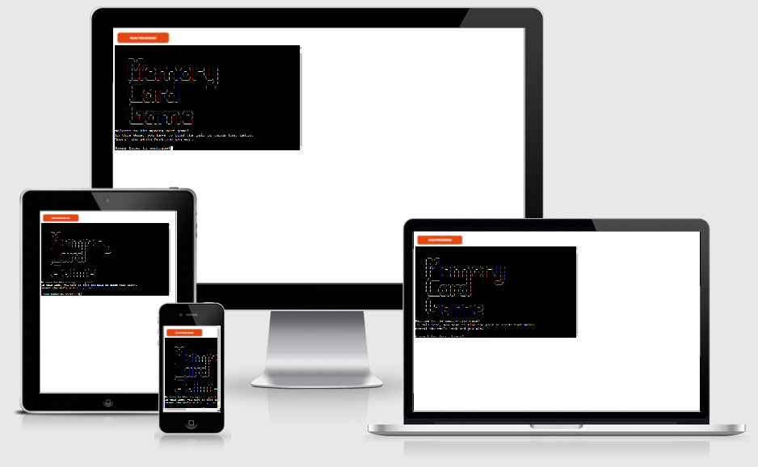
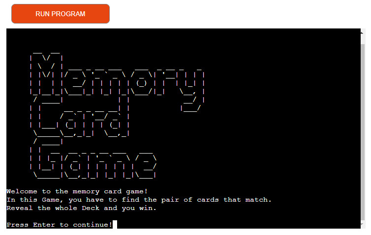
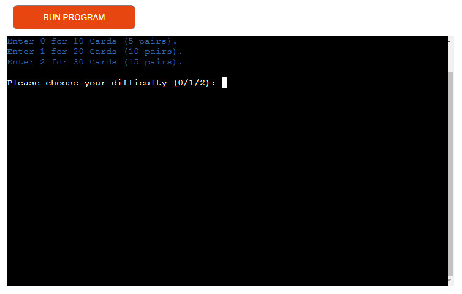
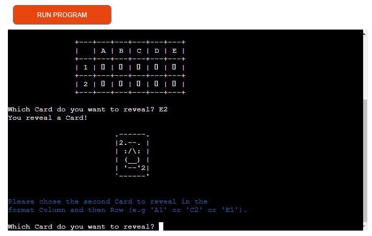
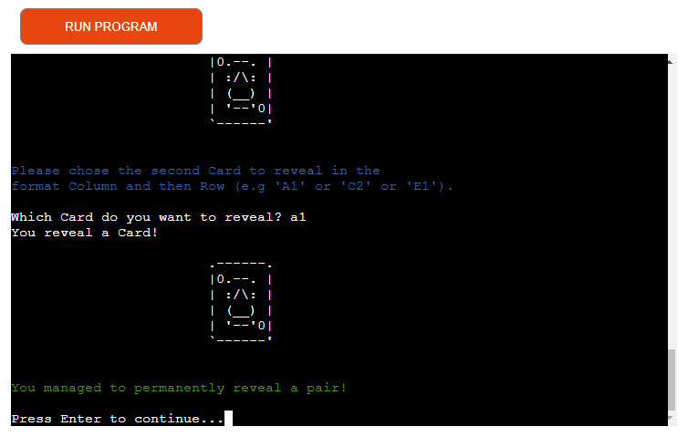
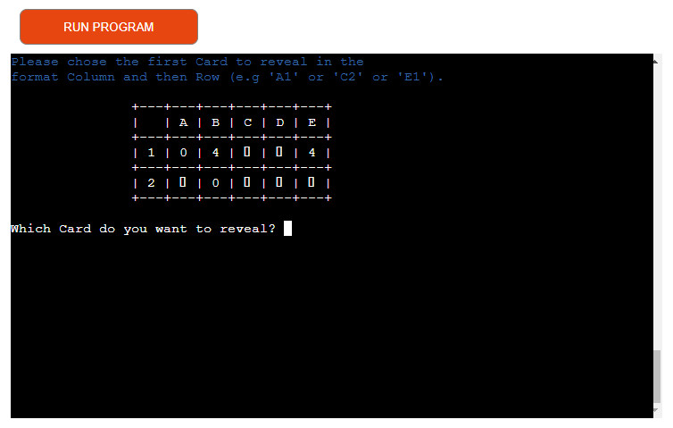
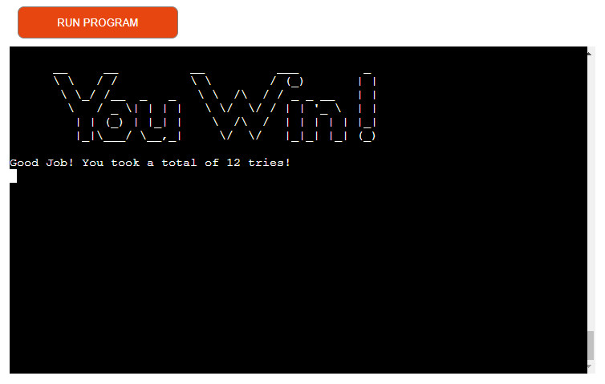
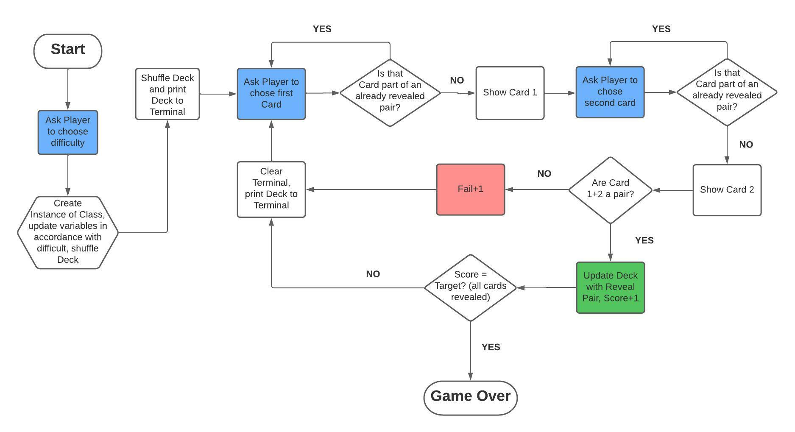
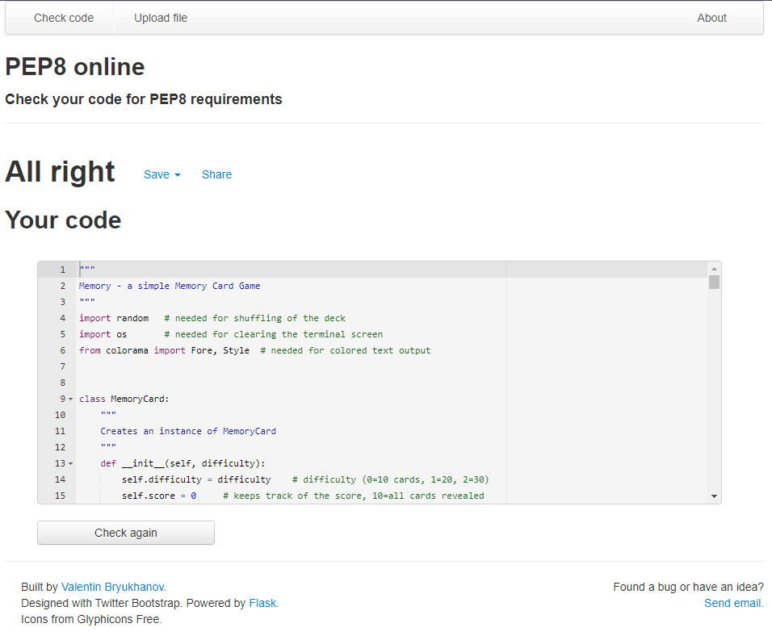
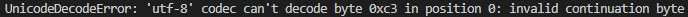

<h1 align="center"><a name="top">Memory Card Game</a></h1>

[View the live project here.](https://portfolio-project-3-memory.herokuapp.com/)

Memory Card Game is a Python terminal game, which runs in the Code Institute mock terminal on Heroku.

Players can try to challenge themselves on different Deck sizes and train their memory to remember each card position. Once they finish the Deck, they are told how many total tries it took to reveal all the pairs in the Deck.

<h2 align="center"></h2>

 

## <a name="tableofcontents">Table of Contents</a>

### I. [The Game and how to play](#thegame)

### II. [Features](#features)

### III. [Flowchart](#flowchart)

### IV. [Technologies Used](#technology)

### V. [Data Model](#datamodel)

### VI. [Testing](#testing)

### VII. [Limitations/Restrictions](#limitations)

### VIII. [Deployment](#deployment)

### IX. [Credits](#credits)

  

## ([^](#tableofcontents)) <a name="thegame">The Game and how to play</a>

###   Basics
-   This is a concentration type game. Players are challenged to remember the position of certain cards and to reveal them in pairs once they figure out matching ones. The goal is to reveal the whole Deck, preferably with minimal amount of wrong guesses. You can read more about the game in the article on [Wikipedia](https://en.wikipedia.org/wiki/Concentration_(card_game)).

###   Starting the Game
-   The Game starts immediately and provides you with a splash screen and some basic information how it works.
<h2></h2>

###   Setting options
-   There is only 1 Setting (Difficulty) which comes in 3 variations.
-   If you want a fast game, the 0 difficulty (Easy) offers you a Deck of 10 Cards (5 pairs)
-   For a medium length game, the 1 difficulty (Normal) offers you a Deck of 20 Cards (10 pairs)
-   In case you want to challenge yourself, the 2 difficulty (Hard) gives you a Deck of 30 Cards (15 pairs)
<h2></h2>

###   Core Gameplay Loop
-   You start by choosing a Card to reveal of the Deck. The available cards (as well as the revealed pairs) are shown to you in a table. 
<h2></h2>

-   You can neither choose the same card twice nor a card that's part of an already revealed pair.
-   After you have chosen 2 Cards, you will get feedback if they match and if they do, they will be shown in the Table when you chose your next cards.
<h2></h2>

-   The screen will then be cleared and you will be able to choose 2 new cards, until all pairs of the Deck are revealed.
<h2></h2>

###   Winning the Game
-   You win the game when you reveal the whole Deck. There is no losing condition. The goal is to repeatedly go through the same gameplay loop and train your brain/memory. Once you win the Game, the program ends and you can restart it by pressing the "Run Program" Button on the top of the screen.
<h2></h2>

 

## ([^](#tableofcontents)) <a name="flowchart">Flowchart</a>

- This Flowchart was used for designing the program before any coding was done
<h2></h2> 

## ([^](#tableofcontents)) <a name="features">Features</a>

###   Random Generation of Decks

- The Deck is randomly shuffled each time the game starts so that the player can enjoy a fresh challenge every time he/she plays.

###   Colored Text

- Different areas of the game are color coded. Whenever there is an explanation for an Input by the Player, it is coded in Blue. When 2 Cards match, the feedback text is colored in green. If they do not match, you get a feedback text in red.

###   ASCII Art

- Players are welcome by an ASCII Art when they start the game. Each revealed Card is also implemented as a little ascii style Card when displayed in the terminal. Lastly, when players finish the Deck, they will see an ASCII Art with the Words "You Win!" at the end of the game.

###   Accepts User Input

- Players can choose 2 cards to be shown. These Inputs are error-checked before being processed. If any wrong Input occurs, the player is asked to repeat their Input until a correct value is found. This includes wrong format, choosing cards that are part of already revealed pairs and choosing the same card twice.

###   Tracking of tries (score)

- The amount of tries a player takes to reveal the whole Deck is tracked by the program. At the end of the game, this is also displayed on the terminal for personal scoretracking.

 

## ([^](#tableofcontents)) <a name="datamodel">Data Model</a>

The MemoryCard Class was used to store all necessary information for running the game. It contains both the card Deck the player is working on to reveal the cards, the solution card deck, difficulty and scores. The Class contains methods to display the Card Deck in a neatly formatted table in the terminal, display cards in nice ascii art and checks if a card is already part of a revealed pair.

 

## ([^](#tableofcontents)) <a name="technology">Technologies Used</a>

### Languages Used

-   [Python](https://en.wikipedia.org/wiki/Python_(programming_language))

### Frameworks, Libraries & Programs Used

1. [Code Institute Python Terminal Webpage:](https://github.com/Code-Institute-Org/python-essentials-template)
    - This Template was used as a requirement for this Project to display the Terminal.
1. [Git](https://git-scm.com/)
    - Git was used for version control by utilizing the Gitpod terminal to commit to Git and Push to GitHub.
1. [GitHub:](https://github.com/)
    - GitHub is used to store the project's code after being pushed from Git.
1. [Gimp:](https://www.gimp.org/)
    - Gimp was used to create, modify and resize all images on this website.
1. [Lucidchart:](https://www.lucidchart.com/pages/)
    - Lucidchart was used for the Flowchart and planning of the program before any coding was actually done.

 

## ([^](#tableofcontents)) <a name="testing">Testing</a>

### General Testing

1. The PEP8 Validator Services were used to validate the project to ensure there were no syntax errors in it.
    - [PEP8 Validator](http://pep8online.com/)
        <h2></h2>
2. There is no need for a testing/validation of the CSS/HTML5 and JS code used in this project because the only modified code is python. Everything else is just the provided template by code institute. For that reason, there is also no Google lighthouse testing or testing on different devices and browsers.
 

### Further Testing

-   Different User Inputs were used when trying to choose the difficulty and Cards, to make sure all Inputs are valid
-   Friends were asked to review the site to point out any bugs and/or user experience issues.

 

### Known Bugs

-   When choosing Difficulty, it can, on rare occurrences, lead to a crash of the Game. The Input itself does not matter, it sometimes simply fails when the int() function is called and in other instances it works fine. Even Tutor Support was unable to reproduce the error, with the same Inputs often working and sometimes not. It might be related to messages on Gitpod with the Python server crashing multiple times, though it did happen on the deployed version on heroku as well. Further Testing is needed to find out why this happens. Please see the screenshot below for the error message.
<h2></h2>

-   Players can scroll up in the terminal and look at their old inputs and reveals. This might sometimes also break the display of the cards, but that is sadly a limitation of the terminal and the template itself.

 

## ([^](#tableofcontents)) <a name="limitations">Limitations/Restrictions</a>

-   This Project is meant to display my ability with Python. Code Institute therefore supplied a Template with a website with a mock terminal where all the code is running in. This is not meant to be modified and is not responsive on all devices.

 

## ([^](#tableofcontents)) <a name="deployment">Deployment</a>

### Heroku

The project was deployed using Code Institute's mock terminal for Heroku using the following steps...

1. Fork or clone this repository
2. Create a new Heroku app
3. Set the buildbacks to 'Python' and 'NodeJS' in that order
4. Add a Config Var named 'PORT' with the value '8000'
5. Link the Heroku app to the repository
6. Click on Deploy

### Forking the GitHub Repository

By forking the GitHub Repository we make a copy of the original repository on our GitHub account to view and/or make changes without affecting the original repository by using the following steps...

1. Log in to GitHub and locate the [GitHub Repository](https://github.com/Mycrosys/portfolio-project-3-memory)
2. At the top of the Repository (not top of page) just above the "Settings" Button on the menu, locate the "Fork" Button.
3. You should now have a copy of the original repository in your GitHub account.

### Making a Local Clone

1. Log in to GitHub and locate the [GitHub Repository](https://github.com/Mycrosys/portfolio-project-3-memory)
2. Under the repository name, click "Clone or download".
3. To clone the repository using HTTPS, under "Clone with HTTPS", copy the link.
4. Open Git Bash
5. Change the current working directory to the location where you want the cloned directory to be made.
6. Type `git clone`, and then paste the URL you copied in Step 3.
7. Press Enter. Your local clone will be created.

Click [Here](https://help.github.com/en/github/creating-cloning-and-archiving-repositories/cloning-a-repository#cloning-a-repository-to-github-desktop) to retrieve pictures for some of the buttons and more detailed explanations of the above process.

 

## ([^](#tableofcontents)) <a name="credits">Credits</a>

### Framework

- The Mock Terminal for Deployment on Heroku belongs to [Code Institute](https://codeinstitute.net/global/) and can be found [here](https://github.com/Code-Institute-Org/python-essentials-template).

### Readme

-   The Basic Structure of the Readme was taken from [Code Institute's Sample Readme](https://github.com/Code-Institute-Solutions/SampleREADME/blob/master/README.md).

### Acknowledgements

-   My Mentor for continuous helpful feedback.
-   Tutor Support for their help.
-   My Peers in Code Institute's Slack channel for their feedback.